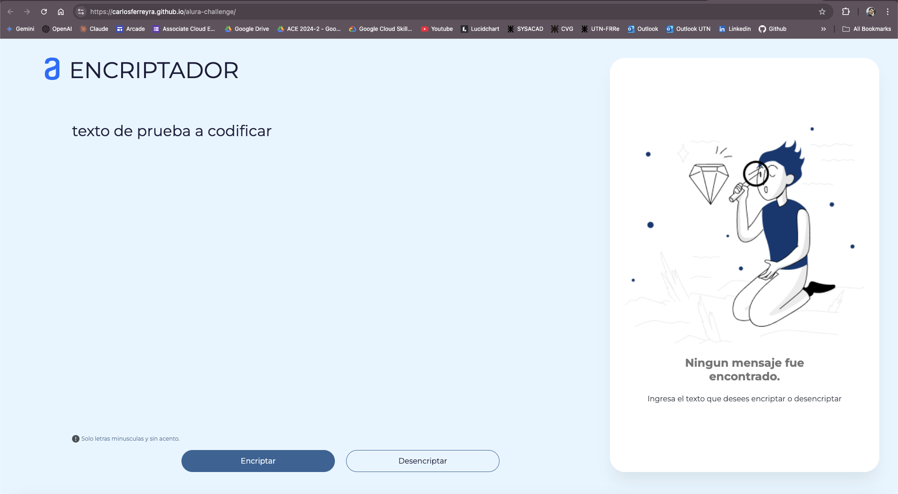
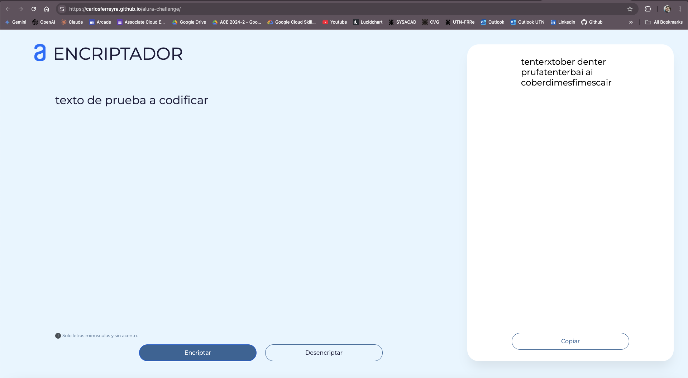
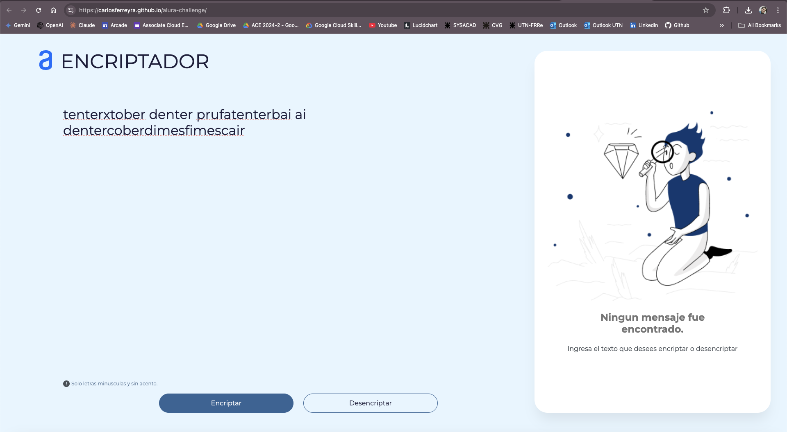
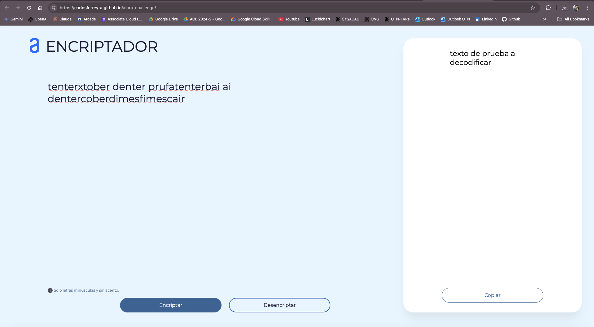
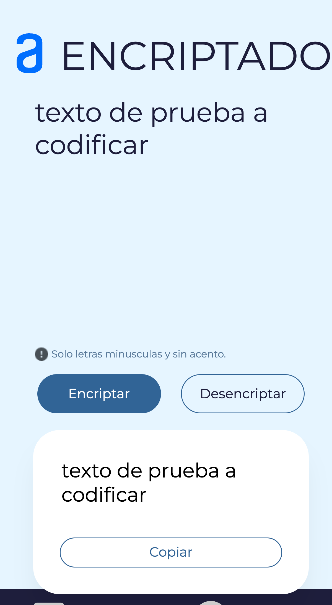
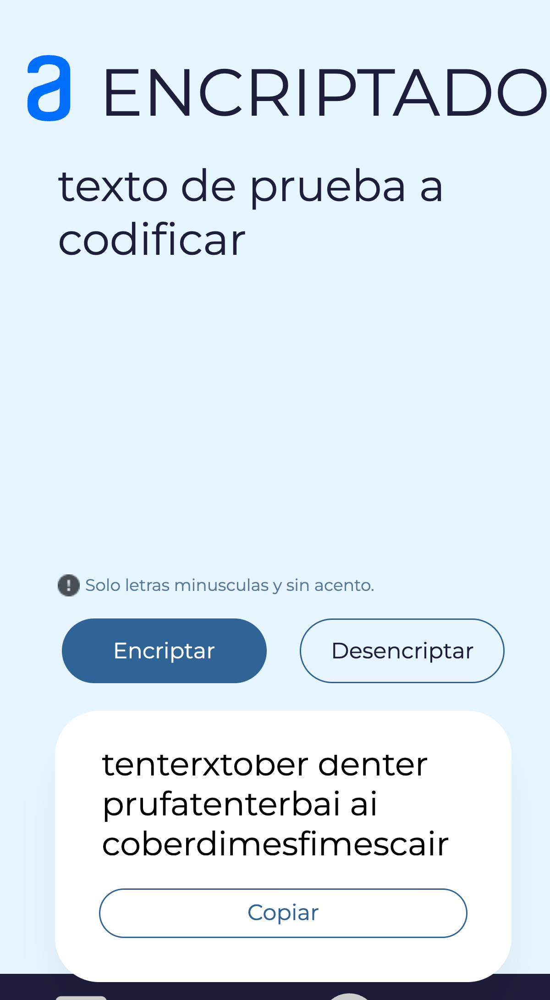

<!-- Readme language: Spanish -->
# alura-challenge

Challenge de la etapa "Principiante en Programacion" en ONE G7.

<!-- tabla de contenidos -->
## Tabla de Contenidos
- [Descripción](#descripción)
- [Requerimientos](#requerimientos)
- [Ejecución](#ejecución)
- [Capturas de Pantalla](#capturas-de-pantalla)
  - [Navegador](#navegador)
  - [Mobile](#mobile)

<!-- fin tabla contenidos -->

## Descripción
Este repositorio contiene el código fuente de la solución al reto de la etapa "Principiante en Programación" en ONE G7. La solución fue desarrollada en HTML, CSS y Javascript, y se encuentra en el archivo `index.js`.

## Requerimientos
Puede Ejecutar la solución en cualquier navegador web moderno, como Google Chrome, Mozilla Firefox, Microsoft Edge, Safari, etc.

## Ejecución
Para ejecutar la solución, puede acceder al mismo desde la url de github pages [aquí](https://carlosferreyra.github.io/alura-challenge/) o clonar el repositorio y abrir el archivo `index.html` en su navegador web.

<!-- menu capturas de pantalla en navegador y mobile -->
## Capturas de Pantalla
Las siguientes capturas de pantalla muestran el funcionamiento de la solución en un navegador web y en un dispositivo móvil.

### Navegador

#### Captura de Texto a codificar:

#### Captura de Texto codificado:

#### Captura de Texto a decodificar:

#### Captura de Texto decodificado:

### Mobile

#### Captura de Texto a codificar:

#### Captura de Texto codificado:

<!-- fin capturas de pantalla -->